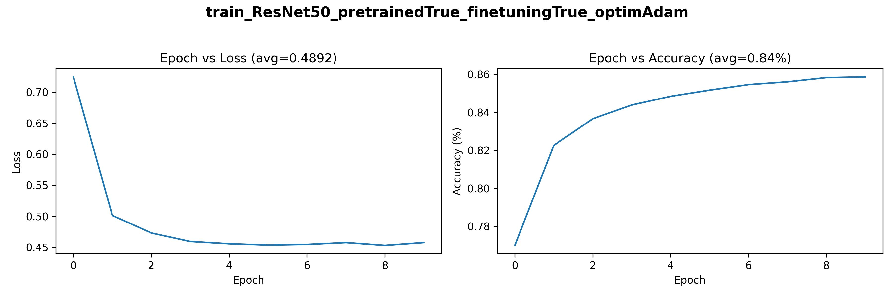
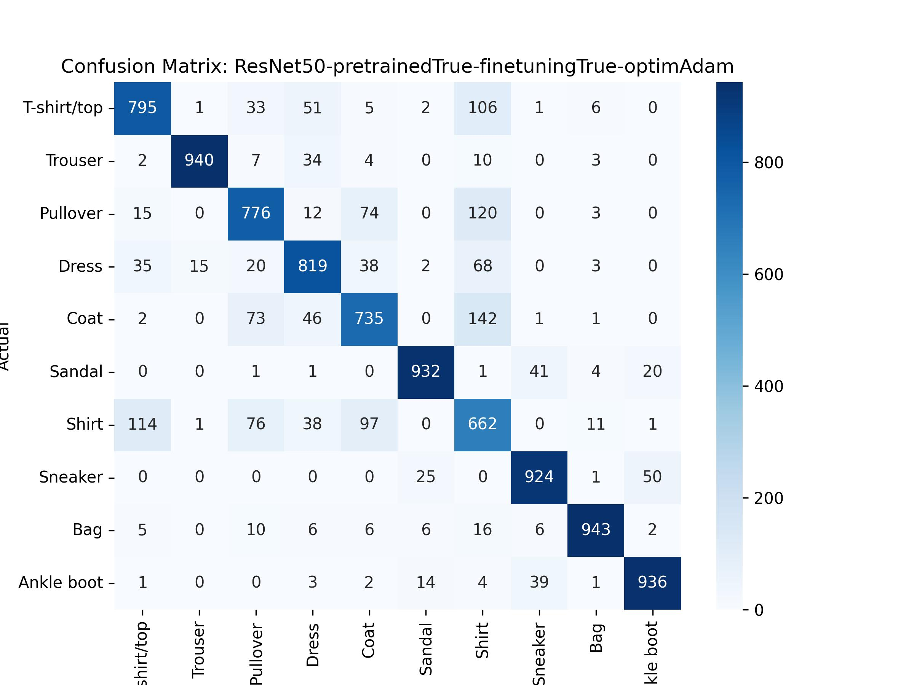
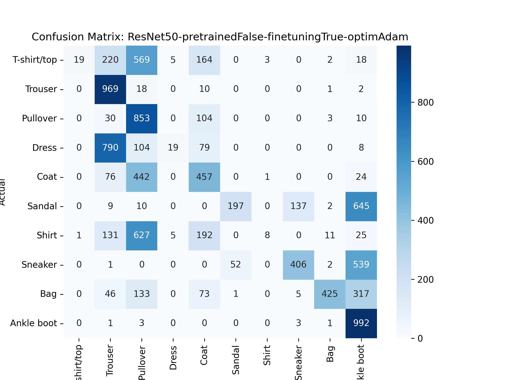

# Pretrained Models Experiment Learnings

## Aim
The aim of this experiment is to learn about and implement variations of transfer learning. As the first experiment in this line of experiments, a secondary goal is to develop reusable modules and a pipeline, in addition to data collection mechanisms, and model performance metrics.

## Experiments
We implemented this experiment using the [PyTorch](https://pytorch.org/) framework for deep learning. We used the [Fashion-MNIST](https://github.com/zalandoresearch/fashion-mnist) dataset with 10 classes (t-shirt/top, trouser, pullover, dress, coat, sandal, shirt, sneaker, bag, ankle boot). We used a [pre-defined ResNet-50 model architecture](https://pytorch.org/vision/main/models/generated/torchvision.models.resnet50.html) from the official Torchvision models library. We trained our models on an [NVIDIA A6000 GPU](https://www.nvidia.com/en-us/design-visualization/rtx-a6000/).

We define a dictionary of hyperparameters, with the following parameters and options:
- `"model_name": "ResNet50"`. Currently we have only used ResNet-50 in this version of the experiment to set a benchmark, in future work on this experiment, we may add more model options. 
- `"pretrained_model": {True, False}`. This is the option for whether or not to use the available pre-trained weights. This is the primary aim of the experiment to determine the model's performance with and without pretrained weights.
- `"finetuning": {True, False}`. This is the option for whether or not to allow finetuning. If True, some extra layers in the model will be unfrozen, allowing those weights to be trained. This is the secondary aim of the experiment to determine the model's performance with additional finetuning.
- `"batchSize": 64`. We have opted to use the default batch size of 64. 
- `"n_epochs": 10`. We trained each combination of model for 10 epochs each, to truly assess the impact of the hyperparameter options over epochs. This is also to allow the model extra time for learning features.
- `"optimizer": {"Adam","SGD"}`. This is the option for which optimizer to use during the training process. Both Adam and Stochastic Gradient Descent are standard training choices, and the aim of this hyperparameter is to allow us to assess how much of an impact uisng different optimizers creates. 
- `"lr": 0.001`. Learning rate for optimizer. 
- `"momentum": 0.9`. Momentum for SGD optimizer.
- `"weight_decay": 0.1`. Weight decay for SGD optimizer.

We used the following combinations of model hyperparameters: `pretrained_model`, `finetuning`, `optimizer`, resulting in $2\times 2\times 2 = 8$ total models trained. On the NVIDIA A6000 GPU, training these 8 models took a cumulative 7008.95 seconds (or ~2 hours).

## Results 

**Table 1.** Results from all 8 experiments described above, sorted in descending order by *Test Accuracy*.

| Pretrained   | Finetuning   | Optimizer   |   Avg Train Loss |   Avg Train Accuracy |   Test Accuracy |
|:-------------|:-------------|:------------|-----------------:|---------------------:|----------------:|
| True         | True         | Adam        |         0.489163 |             0.840053 |           84.62 |
| True         | False        | Adam        |         0.488972 |             0.84032  |           84.37 |
| True         | True         | SGD         |         1.49503  |             0.670385 |           73.38 |
| True         | False        | SGD         |         1.49105  |             0.672567 |           73.25 |
| False        | True         | SGD         |         1.78203  |             0.468215 |           54.02 |
| False        | False        | SGD         |         1.76769  |             0.459962 |           53.97 |
| False        | False        | Adam        |         1.69995  |             0.402492 |           43.86 |
| False        | True         | Adam        |         1.70432  |             0.400813 |           43.45 |

- Using pretrained weights always provides better performance than not using pretrained weights. 
- The difference between finetuning and not is very minimal. 
- The Adam optimizer provides better performance for models trained with pretrained weights, whereas for non-pretrained weight-trained models, SGD boosts performance.

**Fig. 1.** Examples of actual vs predicted labels for 1 randomly-chosen example from each class, from model (`pretrained_model=True`, `finetuning=False`, `optimizer=SGD`).

**Fig. 2.** Example of feature map from first convolutional layer of model (`pretrained_model=True`, `finetuning=False`, `optimizer=SGD`).

**Fig. 3.** Loss-accuracy curves during training of best model (`pretrained_model=True`, `finetuning=True`, `optimizer=Adam`).

**Fig. 4.** Confusion matrices for the best-performing (left) and worst-performing model (right).

    
    

## Conclusions